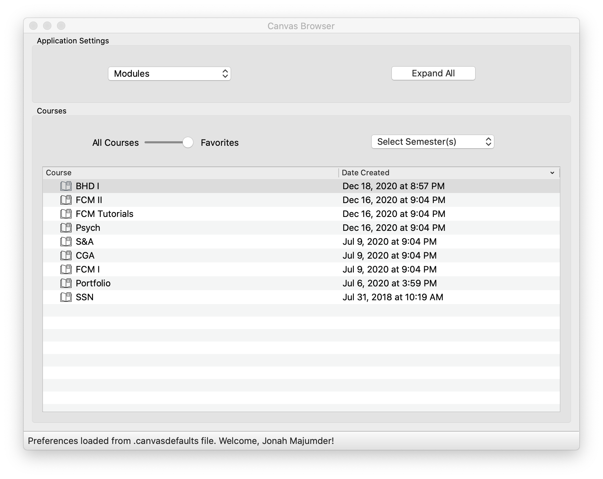

# Python Canvas (Courseworks) GUI

This project builds on the open-source Python package [CanvasAPI](https://canvasapi.readthedocs.io/en/stable/index.html), which is itself built to interact with Instructure's RESTful [HTTP API](https://canvas.instructure.com/doc/api/index.html). Using this package (and Qt for Python), I have built an interactive app allowing a user to browse (and download) courses, files, assignments, and other content.

Below is a depiction of content from my own classes, viewed at the "module" level.



Login is accomplished with an OAuth token (generated online via the user's profile page, as explained [here](https://canvas.instructure.com/doc/api/file.oauth.html#manual-token-generation)). That token, along with an institution-specific base URL, can be included in a file or entered manually.

The (hidden) preferences file is called ".canvasdefaults" and lives in the user's home directory (i.e. /Users/<username>/.canvasdefaults). It is a json file with the following keys:
```
"baseurl": <institution-specific url>
"token": <personal generated oauth token>
"downloadfolder": <path to a local folder>
"defaultcontent": <"modules", "files", "assignments", or "tools">
```
If any of these are deemed invalid (or no file is detected), a GUI will prompt the user to fill them in. This interface also allows the user to save entered credentials for future use.

### Nonstandard (Direct) Dependencies
(All available on PyPI)

- [PyQt5](https://pypi.org/project/PyQt5/)
- [CanvasAPI](https://pypi.org/project/canvasapi/)
- [dateutil](https://pypi.org/project/python-dateutil/)
- [BeautifulSoup](https://pypi.org/project/beautifulsoup4/)

Installing these packages via pip will automatically trigger installation of all other dependencies. See requirements.txt for the full list.

### To do list:

- [X] Pereferences UI allowing specification of login credentials, download destination, default view
- [X] Autosaving/setting defaults file
- [X] Editing of preferences during app operation
- [ ] Test changing user/auth credentials during app operation (i.e. resetting)
- [X] Context menus for everything but expand
- [X] Different course icons to indicate current content mode
- [X] Folder (recursive) downloading
- [X] Module downloading
- [X] Announcement/discussion topic support
- [X] Automatic conversion of Excel files to PDFs (as with Word and Powerpoint files)
- [X] Filtering by semester
- [X] Better column resizing
- [X] Convert from widget to model architecture
- [X] Sorting by date
- [X] Select external tools from "tabs" rather than directly
- [X] Replace terminal printed lines with status bar text
- [X] Dealing with duplicate children
- [X] Deployment into macOS (.app) standalone application
- [ ] Create menu for showing profile, opening preferences editor, quitting, checking connection?
- [ ] Application-level error handling?
- [ ] Multithreaded retrieval of data for "expand all" (back burner)
