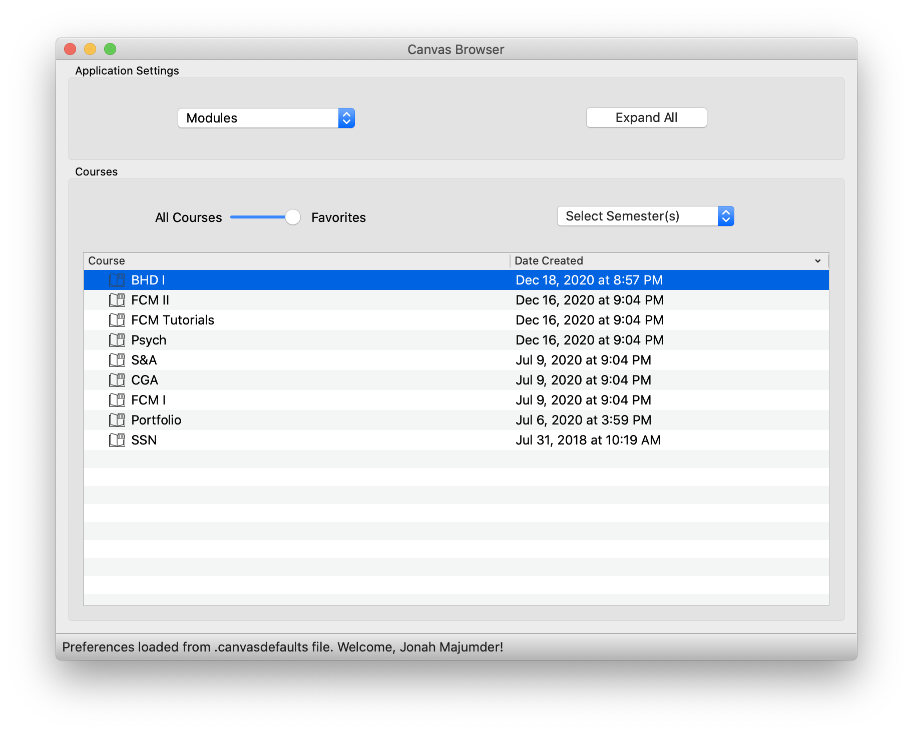
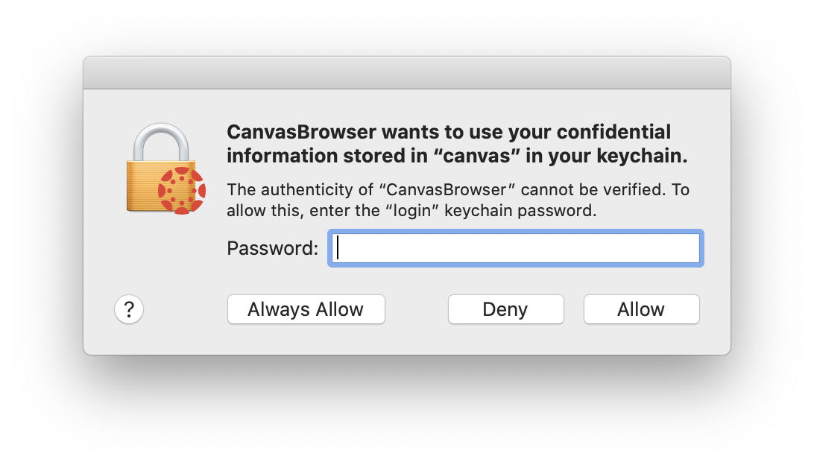

# Python Canvas (Courseworks) GUI

This project builds on the open-source Python package [CanvasAPI](https://canvasapi.readthedocs.io/en/stable/index.html), which is itself built to interact with Instructure's RESTful [HTTP API](https://canvas.instructure.com/doc/api/index.html). Using this package (and Qt for Python), I have built an interactive app allowing a user to browse (and download) courses, files, assignments, and other content.

Below is a depiction of content from my own classes, viewed at the "module" level.



Login is accomplished with an OAuth token (generated online via the user's profile page, as explained [here](https://canvas.instructure.com/doc/api/file.oauth.html#manual-token-generation)). That token, along with an institution-specific base URL, can be included in a file or entered manually.

The (hidden) preferences file is called `.canvasdefaults` and lives in the user's home directory (i.e. /Users/\<username\>/.canvasdefaults). It is a json file with the following keys:
```
"baseurl": <institution-specific url>
"token": <personal generated oauth token>
"downloadfolder": <path to a local folder>
"defaultcontent": <"modules", "files", "assignments", "tools", or "announcements">
```
If any of these are deemed invalid (or no file is detected), a GUI will prompt the user to fill them in. This interface also allows the user to save entered credentials for future use.

### External Feature Support

The Canvas web interface provides access to many external features, visible as tabs for a specific course. The CanvasAPI provides only limited access to these features (referred to as "External Tools" within the API). This is largely due to the fact that API credentials do not generally provide access to the linked platforms. However, it is possible to access data from these features using an authenticated `requests.session`, essentially emulating the Canvas web interface. However, this authentication requires additional credentials beyond the API token required by all other operation of this application.

Rather than attempt to build my own secure password entry/storage system, I decided to make use of the built-in macOS Keychain utility. This has the significant advantagesthe  of being secure, reliable, and easy to implement with the handy [keyring](https://pypi.org/project/keyring/) module.

The procedure to provide authentication (on a Mac) is as follows:
1. Open the macOS application Keychain Access and select the "login" keychain in the upper left-hand corner.
2. Select "File" -> "New Password Item..." from the menu bar. A dialog should appear to add a new "keychain item." 
3. Fill out the fields "Keychain Item Name," "Account Name," and "Password" as specified below, for each set of credentials. Click "Add" to save the new keychain item.
4. Within the "login" keychain, scroll down to verify that a new "application password" is present with your specified name.

In the macOS operating system, applications need explicit authorization to access the macOS Keychain. Therefore, expect to see a dialog such as the one below when this application is run. Enter your local machine account password and select Allow (or Always Allow). It will be necessary to do this for each set of credentials used.



#### Currently implemented credentials, and how to enter them:

The [Echo360](https://echo360.com/) platform is used to host and access recorded lectures. The credentials needed are those normally used with the [web interface](https://echo360.org/). To provide authentication Echo360, a keychain item should be created with:
```
Keychain Item Name: echo360
Account Name: <email used to log in to the Echo360 web interface>
Password: <password used to log in to the Echo360 web interface>
```

Many other external tools can be accessed using your Canvas web interface credentials (typically institution-based). These can be included with a keychain item as follows:
```
Keychain Item Name: canvas
Account Name: <login ID used to log in to the Canvas web interface>
Password: <password used to log in to the Canvas web interface>
```
Unfortunately, this login process is highly institution-specific, and so is unlikely to work at a generic institution.

#### Missing, Incorrect, or Mis-configured Credentials

This application has been deliberately constructed such that a failure locate or authenticate with credentials should not affect normal functioning of the application. So if supplemental credentials are absent/incorrect, operation should continue normally without access to the relevant features.

The best way to verify that credentials have been successfully loaded is to bring up the "User Profile" information ("File" -> "Show User Profile"). Successfully configured credentials will show up in a section titled "Web Credentials" at the bottom of the page.

### Nonstandard (Direct) Dependencies
(All available on PyPI)

- [PyQt5](https://pypi.org/project/PyQt5/)
- [CanvasAPI](https://pypi.org/project/canvasapi/)
- [dateutil](https://pypi.org/project/python-dateutil/)
- [BeautifulSoup](https://pypi.org/project/beautifulsoup4/)
- [keyring](https://pypi.org/project/keyring/)

Installing these packages via pip will automatically trigger installation of all other dependencies. See `requirements.txt` for the full list.

### To do list:

#### Preferences
- [X] Pereferences UI allowing specification of login credentials, download destination, default view
- [X] Autosaving/setting defaults file
- [X] Editing of preferences during app operation
- [X] Test changing user/auth credentials during app operation (i.e. resetting)
- [ ] Conveying information about keyring credentials to user (dialog popup from menu bar?)

#### Tree Item Interaction
- [X] Context menus for everything but expand
- [ ] Handling of right clicking on multiple items
- [X] Course nicknaming by editing item (right click -> Rename)
- [X] Folder (recursive) downloading
- [X] Module downloading
- [X] Automatic conversion of Excel files to PDFs (as with Word and Powerpoint files)

#### Content Mode Handling
- [X] Different course icons to indicate current content mode
- [X] Announcement/discussion topic support
- [X] Select external tools from "tabs" rather than directly
- [X] Convert content handling to filter action (so all data persists but only relevant content shown)

#### Overall GUI Functioning
- [X] Better column resizing
- [X] Sorting by date
- [X] Replace terminal printed lines with status bar text
- [X] Dealing with duplicate children
- [X] Filtering by semester
- [X] Make dialogs open in front of app (rather than on other monitor, etc.)
- [X] Allow "No" instead of cancel for confirm dialogs
- [ ] Multithereaded "expand all" functionality

#### Overall App Operation
- [X] Convert from widget to model architecture
- [X] Deployment into macOS (.app) standalone application
- [X] Testing standalone .app on other machine
- [X] Log file stdout/stderr when bundled
- [ ] Create top menu for showing profile, opening preferences editor, about/credits/README/etc.
- [ ] Application-level error handling?
- [ ] Multithreaded retrieval of data for "expand all" (back burner)


